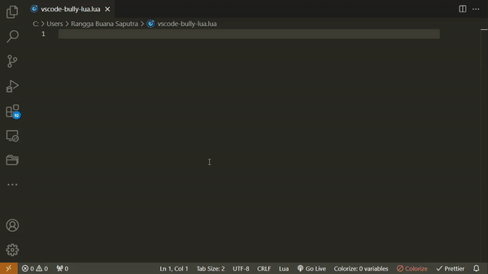
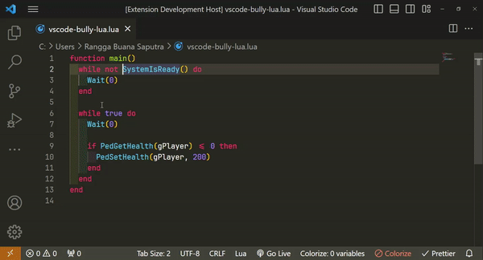
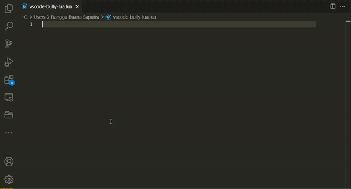
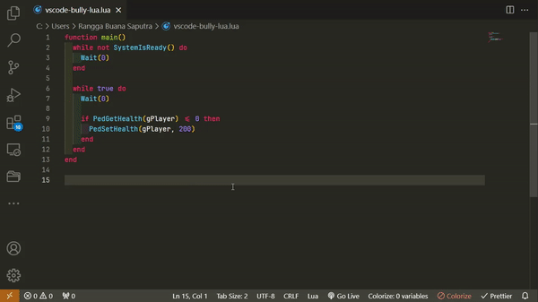
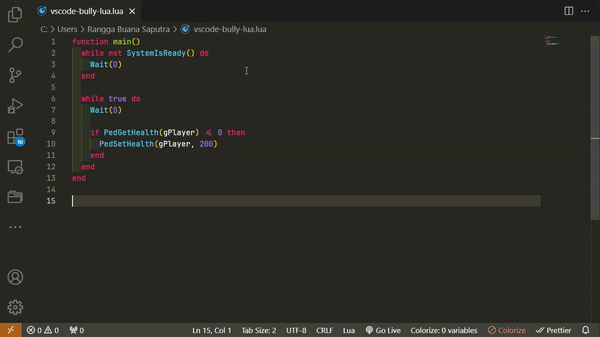

<h1 align="center">

  
  
  Bully Lua Intellisense
  
</h1>

Provide auto completion & signatures help for Bully Natives functions & variables in Lua.

## Features

### Code completion

<!--  -->

### Hover support

<!--  -->

### Code snippets

<!--  -->

## Requirements

- VS Code v1.84.0 or later

## Extension Settings

Open command palette by pressing `Ctrl + Shift + P`, then type `Bully Lua` to see all available settings for this extension.

Currently only 1 command is available.

- `bully-lua.toggleSnippet`: Toggle code snippet on or off.

## Known Issues

- Default suggestion doesn't work (suggests all words in the current file)

Default (code snippet disabled)

<!--  -->

Code snippet enabled

<!--  -->

## Release Notes

### 1.0.0

Initial release.
